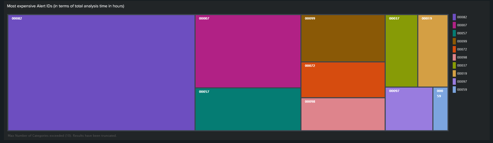
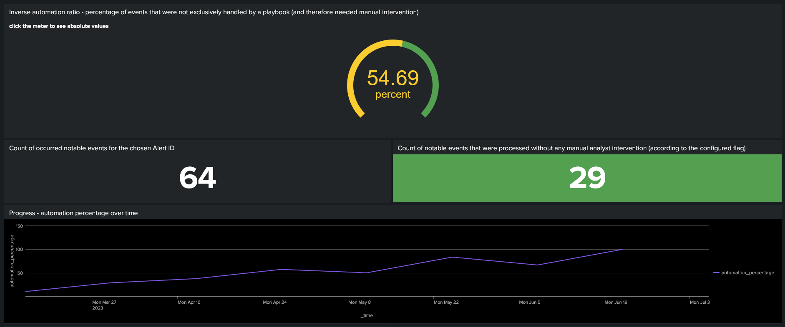

# SOAR Notable automation tracker

Currently working on ramping up automatic responses to notable events in your Splunk Enterprise Security instance? Or maybe you've already automated the bulk of the incoming alerts and just want to communicate the value brought to your organization through the operation of your chosen SOAR-system?

This dashboard can help with:
- identifying which alerts are most expensive in terms of manual analysis hours (you might want to prioritize them when deciding which alerts to automate first)
- tracking your automation progress over time
- selling the added value to management through concrete, quantitative metrics (including MTTR & saved analysis hours estimate)

requirements/assumptions:
- TODO
